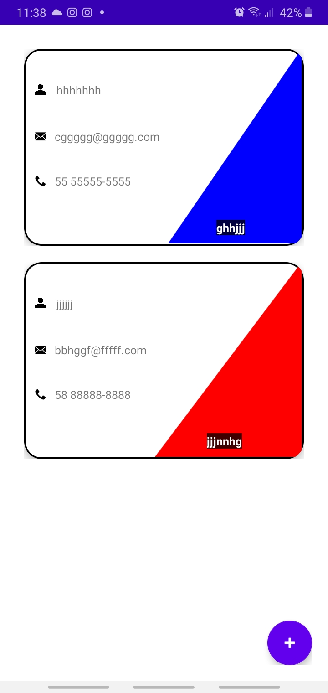
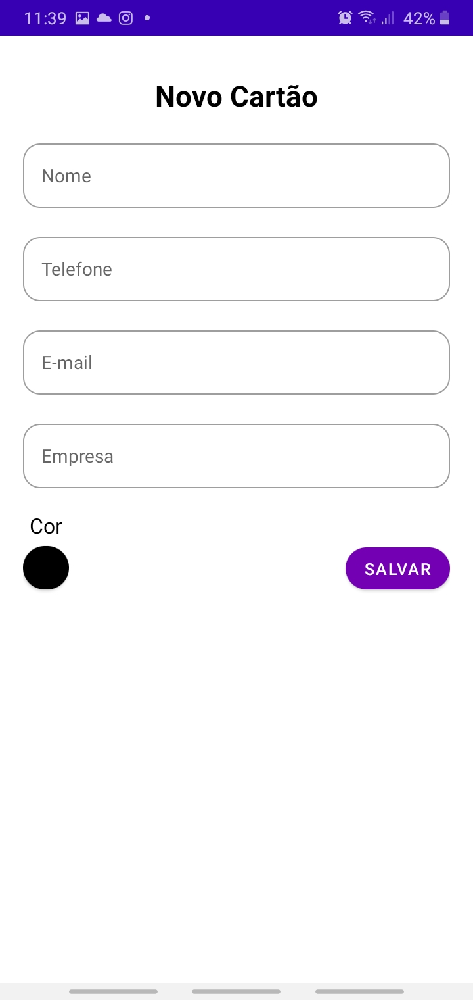
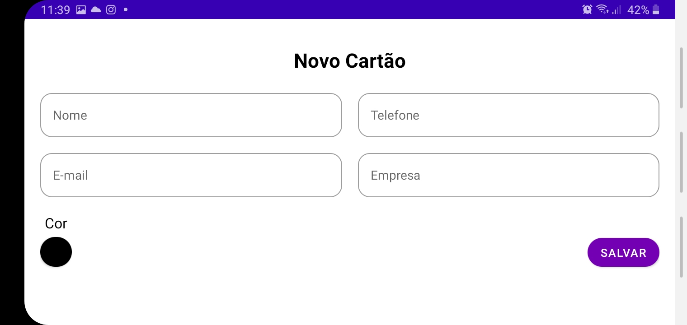
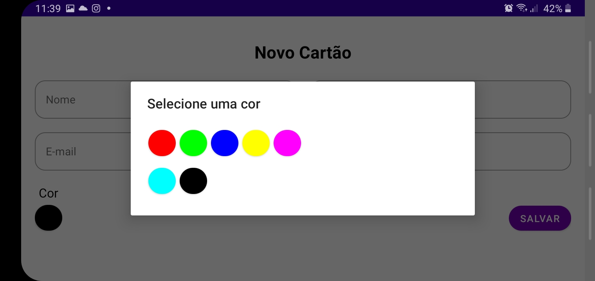

# Mobile-cartao_de_visita
Aplicativo desenvolvido para o Bootcamp Inter Android Developer oferecido pela Digital Inovation One

Crie uma aplicação para gerar o seu próprio cartão de visitas pessoal, usando padrões de projeto e boas práticas de programação Kotlin. Tecnicamente, você desenvolverá um App Android nativo para a criação e listagem dos cartões, os quais podem ter os seguintes dados: nome, empresa, telefone de contato, email e cor de fundo. Tudo isso utilizando o Room para armazenar os dados localmente. Por fim, você é desafiado a entregar seu próprio projeto, incorporando suas próprias evoluções e melhorias! Está preparado?

